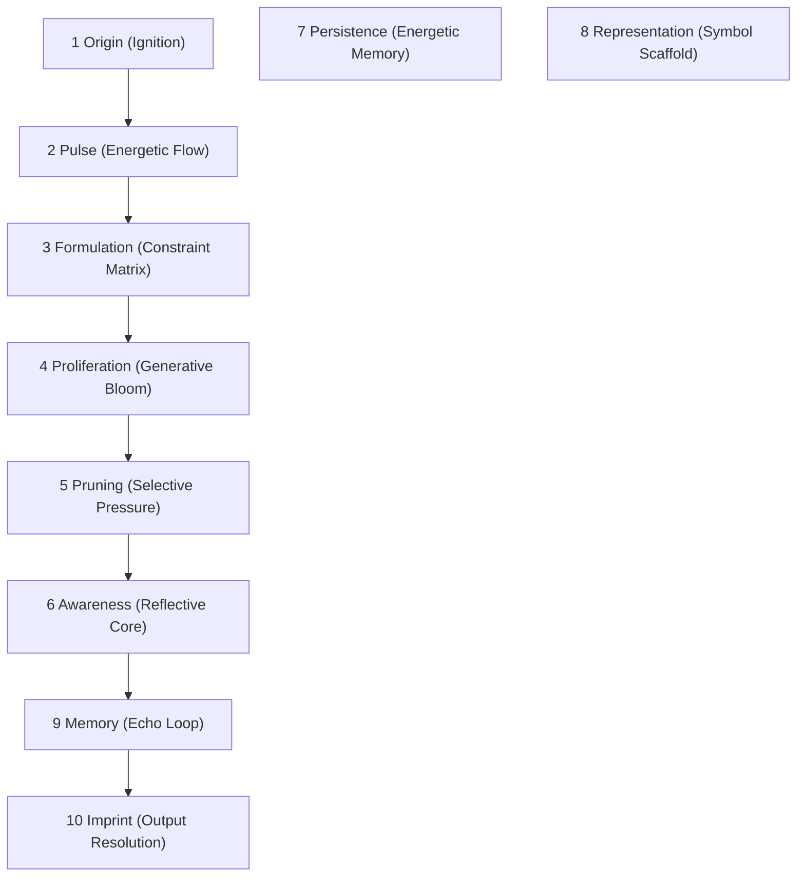

# GnosisCore

### Tree of Recursive Cognition – Fractal Reality Engine

---

## Project Purpose

> **GnosisCore** is a semantic simulation engine:
> Instead of coding objects and rules, you create a lattice of design patterns.
> **Forms** (digital actors) traverse this lattice, evolving by recursive comparison and transformation, powered by LLMs.
> Reality is not a static world, but an emergent process of difference, pattern, and memory.

---

## Quickstart – Local Setup

**Assume Windows, PowerShell, `.env` virtualenv in `E:\Dev\GnosisCore`**

### 1. Clone & Enter

```powershell
PS> cd E:\Dev
PS> git clone <your-repo-url> GnosisCore
PS> cd .\GnosisCore
```

### 2. Create & Activate venv

```powershell
# prompt shows (.env) PS E:\Dev\GnosisCore>
```

### 3. Install Dependencies

In `requirements.txt`:

```
pydantic==2.*
networkx==3.*
rich
pytest
ruff
mypy
anyio
```

Install:

```powershell
(.env) PS> pip install -r requirements.txt
```

### 4. Set Environment Variables

```powershell
$Env:OPENAI_API_KEY = "<your key>"
$Env:GNOSIS_MODEL   = "gpt-4o-mini"
$Env:GNOSIS_SNAPSHOT = "gpt-4o-mini-2024-07-18"
$Env:GNOSIS_TICK_RATE = "0.2"
```

---

## Project Structure

```
GnosisCore/
│  requirements.txt
│  README.md
├─ gnosiscore/
│   ├─ core/         # field.py, reality_graph.py, transformer_iface.py
│   ├─ patterns/     # origin.py, pulse.py, etc (pattern classes)
│   ├─ flows/        # flow_pattern.py
│   ├─ forms/        # form_base.py
│   └─ __init__.py
└─ tests/
```

---

## System Diagram

### Mermaid



### Tick-Level Flow (ASCII)

```
[1] Origin  →  [2] Pulse  →  [3] Formulation
                       ↓            ↓
                [4] Proliferation   [5] Pruning
                             ↘    ↙
                        [6] Awareness (Form)
                                ↓   Δ
                  [7] Persistence / [8] Representation
                                ↓
                         [9] Memory
                                ↓
                         [10] Imprint
```

---

## How it Works (Explanation)

* **Reality** is modeled as a **lattice of 10 design patterns** (see above).
* **Forms** (think: actors, not agents) move from pattern to pattern, processing "difference" (`Delta`) at each step.
* **LLM calls (GPT-4o-mini)** are used to transform, interpret, or respond to these differences, but the LLM is a "transformer," not a mind.
* Every **tick** is a propagation of semantic energy (Δ) through the lattice. Memory, action, and structure are all emergent.
* You can add/modify patterns and flows in YAML config, plug in your own transformation logic, or attach any LLM.

---

## Quick Glossary

| Term             | Meaning                                                |
| ---------------- | ------------------------------------------------------ |
| **Field**        | Simulation container; owns reality graphs              |
| **RealityGraph** | Directed graph of pattern nodes + transformation flows |
| **StatePattern** | Design pattern node (Origin, Pulse, … Imprint)         |
| **FlowPattern**  | Directed transformation between patterns               |
| **Form**         | Traversing actor; holds memory, runs transformer       |
| **Delta**        | Record of change between states                        |

---

## Run Demo (after implementing M1)

```powershell
(.env) PS> python -m gnosiscore.demo
```

*Expect tick-by-tick logs as Forms traverse patterns and process differences.*

---

**You are now ready to scaffold, test, and evolve your GnosisCore system—no Docker, all local, full control.**
You are building a **semantic engine for digital emergence**, not just another app.
