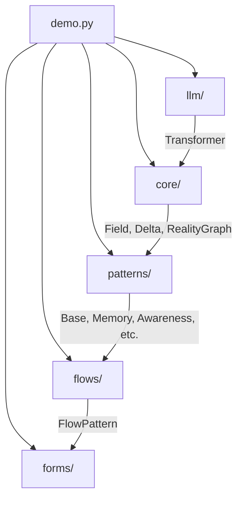

# Architecture & Design Patterns

This document describes the architecture, core design patterns, and component relationships in GnosisCore.

## High-Level Architecture

GnosisCore is organized around modular patterns and flows, enabling flexible composition of reasoning, memory, and data processing components.

## Key Components

- **core/**: Foundational classes and interfaces (e.g., `field.py`, `delta.py`, `reality_graph.py`, `transformer_iface.py`)
- **patterns/**: Modular patterns for memory, awareness, persistence, representation, and more
- **flows/**: Flow composition and orchestration (e.g., `flow_pattern.py`)
- **forms/**: Structured data and form abstractions
- **llm/**: Interfaces for large language models (e.g., `transformer.py`)
- **configs/**: Configuration files for pattern trees and system setup

## Design Patterns

- **Pattern-Based Modularity:** Each pattern (memory, awareness, etc.) is a reusable module with a clear interface.
- **Flow Composition:** Flows define how patterns interact and process data.
- **Persistence Layer:** Patterns can persist and retrieve state as needed.
- **Representation & Imprint:** Patterns for representing and imprinting knowledge or data.

## Component Relationships

- Patterns interact via flows, exchanging data and state.
- Core modules provide base abstractions and utilities.
- LLM interfaces enable integration with transformer models.
- Forms provide structured input/output for patterns and flows.

## Extensibility

- New patterns and flows can be added by implementing the appropriate interfaces.
- The architecture supports plug-and-play experimentation with new cognitive or reasoning modules.

See [systemPatterns.md](../memory-bank/systemPatterns.md) for additional technical details.
